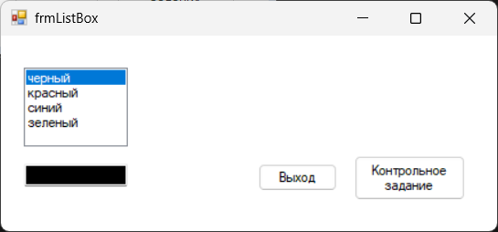
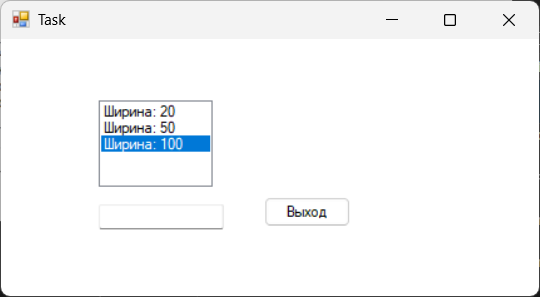

# Лабораторная работа 2

## Элемент управления ListBox (список), свойства и методы списка, программирование с ветвлением

### Описание задания:
Измените свойство Backcolor (Задний фон) текстового поля при помощи
элемента управления ListBox – список

### Цель
Целью работы является ознакомление с элементом управления в
visual c# Listbox. Изучаются свойства добавления и удаления пунктов списка
listbox. Вводится понятие программирования с ветвлением.

---
### Интерфейс главной формы (frmListBox.cs)

Название проекта: `Lab2`, название файла формы `frmListBox.cs`

---

### Инструментарий

| Объект              | Свойство `Name` | Свойство `Text`     |
|---------------------|-----------------|---------------------|
| **Форма**           | `frmListBox`    | frmListBox          |
| **Кнопка**          | `btnExit`       | Выход               |
| **Текстовое поле**  | `txt`           |                	  |
| **Cписок**  		 	 | `lst`           |                     |
| **Кнопка**          | `tasksBtn`      | Контрольное задание |

---

### Задание (Task.cs)

### Описание задания:
Добавьте ListBox для изменения ширины (атрибут Width) текстового
поля: минимальная — 20, средняя – 50, максимальная — 100. Примечание: использовать свойство текстового поля Size,
и System.Drawing.Size(значение ширины, значение высоты)

---

### Интерфейс формы первого задания (Task1.cs)

название файла формы `Task.cs`

---

### Инструментарий
| Объект              | Свойство `Name` | Свойство `Text` |
|---------------------|-----------------|-----------------|
| **Форма**           | `Task`          | Task            |
| **Кнопка**          | `btnExit`       | Выход           |
| **Cписок**  		 	 | `lst`           |                 |
| **Текстовое поле**  | `txt`           |                 |

---
